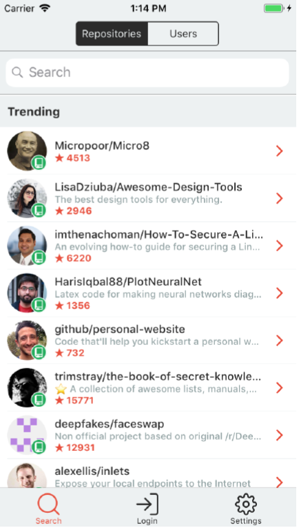
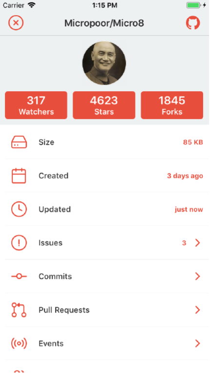

**REST CLIENT PROJESİ**

The purpose of the project is listing the trending repositories in Github using the Github Api. The app will be developed according to the given designs.  
The application will contain Single Activity, Multiple Fragment.  

--- 

---
